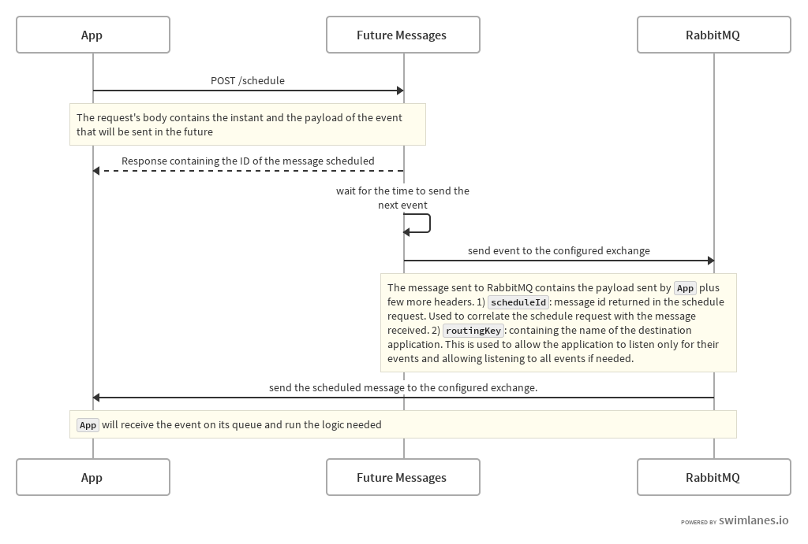

# Future Messages
[](https://circleci.com/gh/lazydevorg/future-messages/tree/master)

`Future Messages` (FM) aims to be a simple way to deal with timed events in message based systems.

Message based systems have to deal with temporal problems like scheduling things to happen in the future.
A common solution to this are batch jobs that run regularly in order to take care of the timed
business logic (not directly driven by events in the system).

[Greg Young describes](https://www.infoq.com/news/2014/06/dddx-young-scheduling#) another solution to this problem
consisting in sending a message to a system that will deliver it back to sender at a specified instant in
the future.
This pattern removes the time problem delegating the trigger of the event to a separate system. This way only the
order of the message will matter for the sender application.

FM exposes a simple REST API to schedule future messages and use RabbitMQ to deliver them.




## Dependencies

* [PostgreSQL](https://www.postgresql.org/) for storing the scheduled messages.
* [RabbitMQ](https://www.rabbitmq.com/) for delivering the messages scheduled.

By default FM connect to PostgreSQL on `localhost:5432` using the database `futuremessages`. Username `futuremessages`
and password `futuremessages`.

FM connects to RabbitMQ on `localhost:5672` using the topic exchange `future-messages`. Username: `guest`, and password
`guest`.


## Usage

Run the application

```bash
java -jar future-messages-0.8.jar
```

Connect your application, or a RabbitMQ client, to the `future-messages` exchange. Make sure to set the routing key of
the queue to `*` to receive every message or to the same value as the request's `destination` field shown in the next
step.

Make an API schedule request

```http request
POST /schedule HTTP/1.1
Host: localhost:8080
Content-Type: application/json

{
	"start": "2282-12-31T13:00:00Z",
	"destination": "postman",
	"operation": "checkProduct",
	"user": "myuser",
	"product": "123456"
}
```

This request will schedule a future message to be sent on the *31st of December of the year 2282 at 13:00*. I would use
a different instant for experiment. Can get a little boring waiting for long!

The request will set the destination (the caller application) to *postman* and will set the payload with the rest of the data:

```json
{
	"operation": "checkPrice",
	"user": "myuser",
	"product": "123456"
}
```

The response will be something like:

```json
{
    "start": "2282-12-31T13:00:00Z",
    "id": "c70850179ea1-dbbc80d0-6400-4a32-a8d7-afaceba64556"
}
```

The response indicates that the message has been scheduled successfully returning the instant in which will be sent, as
a confirmation, and it's ID used as a correlation ID. In the future versions of FM this ID will be used to get info on
the scheduled job or to delete it. 

The future message will then be sent to the caller application through the configured RabbitMQ's exchange. 

## Configuration

FM is a [Spring Boot 2](https://spring.io/projects/spring-boot) application so easily configurable.
Following the environment variables, and default values, to define in order to configure FM:

```
SPRING_DATASOURCE_URL = "jdbc:postgresql://localhost:5432/futuremessages"
SPRING_DATASOURCE_USERNAME = "futuremessages"
SPRING_DATASOURCE_PASSWORD = "futuremessages"

EXCHANGE_NAME = "future-messages"                   # RabbitMQ exchange name

LOGGING_FORMAT = "text" | "json"

SPRING_ZIPKIN_ENABLED = true                        # whether send or not tracing events
SPRING_ZIPKIN_SENDER_TYPE = "rabbit" | "web"        # connect to Zipkin through RabbitMQ or HTTP
SPRING_ZIPKIN_BASE_URL = "http://localhost:9411/"   # only user for web sender type

SPRING_SLEUTH_SAMPLER_PROBABILITY = 1.0             # percentage of tracing events to send
```

### Database

When FM starts it creates the database schema, if not previously created. This means that the database user has to have
permission to do so.

The database schema is handled by the [Quartz scheduler](http://www.quartz-scheduler.org/) so please refer to its
documentation for more details.

## Monitoring

The default monitoring system is [Prometheus](https://prometheus.io/) available through
[Spring Boot Actuators](https://docs.spring.io/spring-boot/docs/current/reference/html/production-ready-endpoints.html)
at the endpoint `/actuator/prometheus`. Many metrics are provided by default plus three custom ones:

```
# TYPE scheduler_scheduled_total counter
scheduler_scheduled_total 363.0                    (1)

# TYPE scheduler_triggers_total counter
scheduler_triggers_total{event="fired"} 363.0      (2)
scheduler_triggers_total{event="misfired"} 0.0     (3)
```

1. The number of successful schedule requests.
2. The number of future messages sent.
3. The number of future messages that were sent after the scheduled time. This can happen when all the scheduler
thread are busy. In this case the future message will send as soon as there is availability in the thread pool. This
will be configurable in the future.

The number of misfired events (3) is a useful indicator to understand if the number of threads available are enough to
handle the amount of future messages to send. Monitor this value will help tuning the thread pool. By default 4
thread are used to serve all the future messages.

## Tracing

FM uses [Zipkin](https://zipkin.io/) for tracing schedule requests and future messages sent. This makes easier to
integrate FM in a distributed systems since a trace is used to correlate schedule requests with future messages sent.
Refer to the Zipkin documentation for more details on the topic.

Refer to the *SPRING_ZIPKIN* variables in the configuration section to change the default behaviour.
